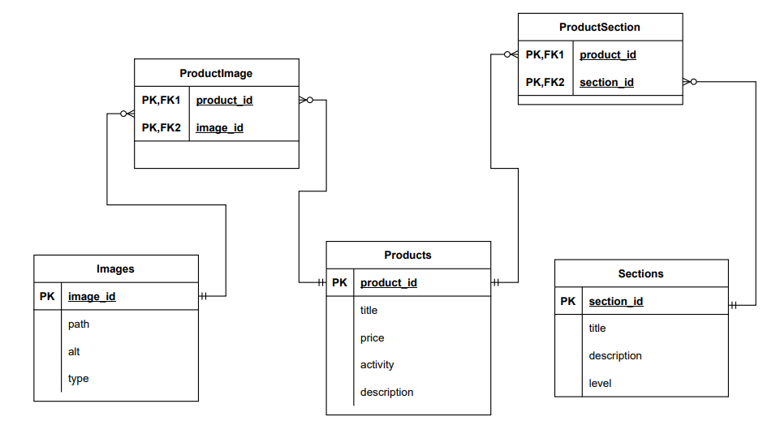
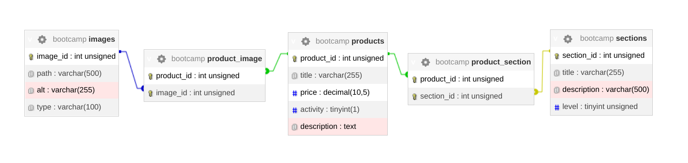

# i20 Backend Bootcamp

Build web application with nginx, php, mysql

## Technical task

### Общие требования:
1. В качестве базы данных используется MySQL. Для сайта должна быть создана
   отдельная база данных.
2. В качестве веб-окружения можно использовать XAMPP, OpenServer, Denwer
   для того, чтобы не тратить время на настройку инфраструктуры. Если же у вас
   есть готовый хостинг – вообще замечательно.
3. Для наполнения БД тестовыми данными нужно подготовить SQL-файлы,
   соответствующие спроектированной структуре БД.
4. Для диаграммы можно выбирать любой удобный инструмент, важно, чтобы
   база данных была описана четко и подробно, и все связи были поясняны.
5. Дублирования данных в базе быть не должно.
6. Написания кода на PHP и выполнение запросов в базу данных не требуется на
   этом задании.

### Техническое задание будущего сайта:
1. На сайте должны отображаться разделы каталога с указанием количества
   товаров внутри.
2. При клике на раздел каталога, пользователь попадает на детальную страницу
   раздела.
3. Разделы без товаров не показывать ни в каких списках.
4. Разделы отсортировать по количеству товаров внутри (сперва те, у которых
   больше товаров).
5. На странице раздела перечислены товары этого раздела с постраничной
   навигацией по 12шт, есть заголовок раздела и краткое описание раздела.
6. Товар может быть в 2ух и более разделах.
7. Неактивные товары не показывать.
8. У разных товаров может быть одна и та же картинка, которую нет смысл
   хранить дважды.
9. У товаров в списке отображается:
   a. один основной раздел, где он представлен,b. заголовок,
   c. картинка для анонса.
10. Картинки должны иметь атрибут ALT.
11. На странице товара перечислены:
    - Заголовок
    - Картинка
    - Дополнительные картинки только для детальной страницы товара
    - Список разделов, где этот товар представлен.
    - Цена
    - Цена без скидки
    - Цена по промокоду
    - Описание

## How to build the project

- clone repo
- run `docker-compose up`
- `docker exec -it bootcamp_db mysql -uroot -proot`
- `create database bootcamp; exit;`
- `cat db/dump.sql | docker exec -i bootcamp_db /usr/bin/mysql -u root --password=root bootcamp`
- connect localhost:8080
- database: db; username: root; password: root

## Database

pic_1. Er diagram

pic_2. Physical diagram mysql

