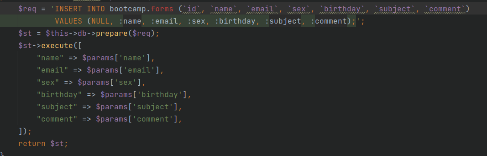
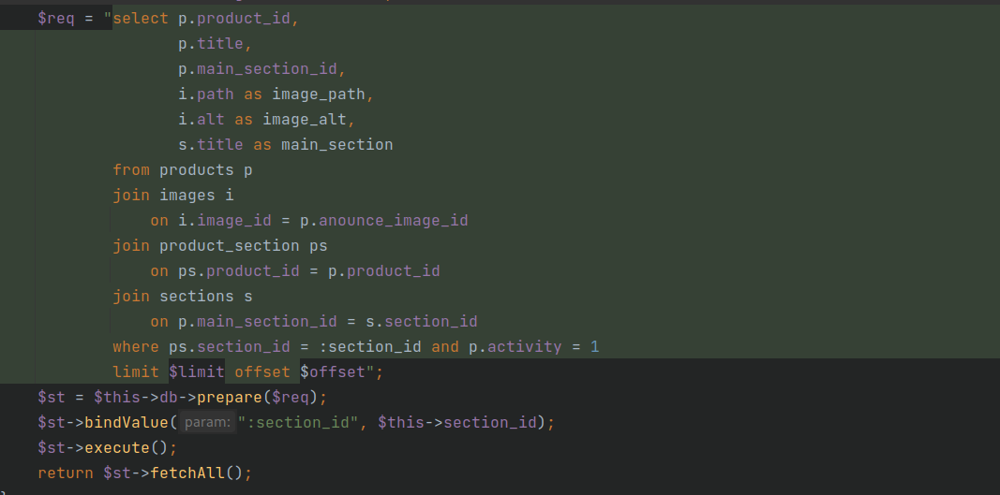
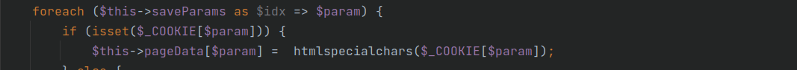

# i20 Backend Bootcamp

Build web application with nginx, php, mysql

## Technical task

### Общие требования:
1. В качестве базы данных используется MySQL. Для сайта должна быть создана
   отдельная база данных.
2. В качестве веб-окружения можно использовать XAMPP, OpenServer, Denwer
   для того, чтобы не тратить время на настройку инфраструктуры. Если же у вас
   есть готовый хостинг – вообще замечательно.
3. Для наполнения БД тестовыми данными нужно подготовить SQL-файлы,
   соответствующие спроектированной структуре БД.
4. Для диаграммы можно выбирать любой удобный инструмент, важно, чтобы
   база данных была описана четко и подробно, и все связи были пояснены.
5. Дублирования данных в базе быть не должно.
6. Написания кода на PHP и выполнение запросов в базу данных не требуется на
   этом задании.

### Техническое задание будущего сайта:
1. На сайте должны отображаться разделы каталога с указанием количества
   товаров внутри.
2. При клике на раздел каталога, пользователь попадает на детальную страницу
   раздела.
3. Разделы без товаров не показывать ни в каких списках.
4. Разделы отсортировать по количеству товаров внутри (сперва те, у которых
   больше товаров).
5. На странице раздела перечислены товары этого раздела с постраничной
   навигацией по 12шт, есть заголовок раздела и краткое описание раздела.
6. Товар может быть в 2ух и более разделах.
7. Неактивные товары не показывать.
8. У разных товаров может быть одна и та же картинка, которую нет смысл
   хранить дважды.
9. У товаров в списке отображается:
   a. один основной раздел, где он представлен
   b. заголовок,
   c. картинка для анонса.
10. Картинки должны иметь атрибут ALT.
11. На странице товара перечислены:
    - Заголовок
    - Картинка
    - Дополнительные картинки только для детальной страницы товара
    - Список разделов, где этот товар представлен.
    - Цена
    - Цена без скидки
    - Цена по промокоду
    - Описание

## How to build the project

- clone repo
- `cd backend-bootcamp`
- run `docker-compose up -d`
- run `sh install.sh`
- connect localhost
- database: db; username: root; password: root

## Database

pic_1. Er diagram

pic_2. Physical diagram mysql

### Описание

Основная таблица products связана с images и sections связями многие ко многим.
Для реализации созданы 2 связующие таблицы product_images и product_section.
У основных таблиц первичными ключами являются id.
Второстепенные таблицы состоят из пары внешних ключей, которые в комбинации являются внешним ключом.

## Безопасность

### SQL injection

Внедрение SQL-кода (англ. SQL injection / SQLi) — один из распространённых способов взлома сайтов и программ, работающих с базами данных, основанный на внедрении в запрос произвольного SQL-кода.
Внедрение SQL, в зависимости от типа используемой СУБД и условий внедрения, может дать возможность атакующему выполнить произвольный запрос к базе данных (например, прочитать содержимое любых таблиц, удалить, изменить или добавить данные), получить возможность чтения и/или записи локальных файлов и выполнения произвольных команд на атакуемом сервере.
Атака типа внедрения SQL может быть возможна из-за некорректной обработки входных данных, используемых в SQL-запросах.

Для защиты от данного вида уязвимостей использовались подготовленные запросы:

### XSS 

XSS (англ. Cross-Site Scripting — «межсайтовый скриптинг») — тип атаки на веб-системы, заключающийся во внедрении в выдаваемую веб-системой страницу вредоносного кода (который будет выполнен на компьютере пользователя при открытии им этой страницы) и взаимодействии этого кода с веб-сервером злоумышленника. 
Является разновидностью атаки «Внедрение кода».

Для защиты от данного вида уязвимостей выводимые данные, полученные от пользователя, проверяются на html спец. символы:

