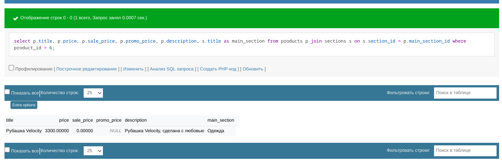

## 1. Получение категорий

###  Одним запросом получаем все, что нужно

```mysql
select s.section_id,
       s.title,
       s.description,
       count(p.product_id) as product_quantity
from sections s
         join product_section ps
              on s.section_id = ps.section_id
         join products p
              on p.product_id = ps.product_id
group by s.title
order by product_quantity desc;
```


## 2. Получение всех товаров в категории

### Одним запросом получаем все, что нужно

```mysql
select p.title, p.price, i.path, i.alt
from products p
         join images i
              on i.image_id = p.anounce_image_id
         join product_section ps
              on ps.product_id = p.product_id
where ps.section_id = 1 and p.activity = 1;
```


## 3. Получение свойств товара

### Для минимизации обработки данных php, делаем 3 запроса

- Для получения общей информации

```mysql
select p.title, p.price, p.sale_price, p.promo_price, p.description, s.title as main_section
from products p
	join sections s
    on s.section_id = p.main_section_id
    where product_id = 6;
```



- Для получения разделов

```mysql
select s.title from sections s
	join product_section ps
        on ps.section_id = s.section_id
    where ps.product_id = 6;
```


- Для получения картинок

```mysql
select i.path, i.alt, i.type from images i
    join product_image pi
        on pi.image_id = i.image_id
where pi.product_id = 6;
```


## 4. Дополнительные запросы

```mysql
select s.title,
       s.description,
       count(p.product_id) as product_quantity
from sections s
         left join product_section ps
              on s.section_id = ps.section_id
         left join products p
              on p.product_id = ps.product_id
group by s.title;
```


```mysql
select s.title,
       s.description,
       count(p.product_id) as product_quantity
from sections s
         join product_section ps
              on s.section_id = ps.section_id
         join products p
              on p.product_id = ps.product_id
group by s.title
having product_quantity > 1;
```


